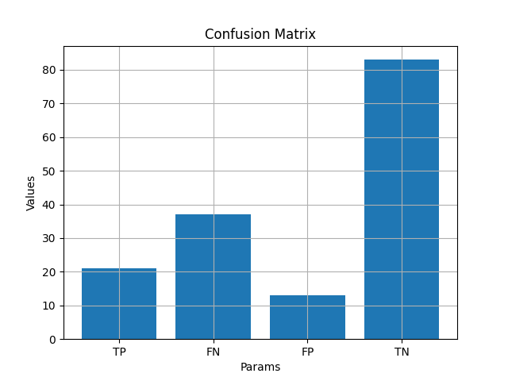

# ⚕ Diabetes Prediction - Logistic Regression :chart_with_upwards_trend:
- Algoritmo de Machine Learning utilizado para prever se mulheres acima dos 21 anos provenientes da India podem desenvolver diabetes baseado nos seguintes biomarcadores:
  - Números de gravidez
  - Glicose do sangue
  - Pressão arterial
  - Largura da pele
  - Nível de insulina
  - IMC
  - Função de Pedigree de Diabetes
  - Idade

[]()
[]()
[]()
[]()
[]()
[]()
---

## :beginner: Tecnologias utilizadas:
- **Pandas**
- **Numpy**
- **Matplotlib**

## :pencil: Propósito:
Com este repositório você poderá entender um pouco melhor como a técnica de Regressão Logística utilizada em Machine Learning funciona e pode ser aplicada aos problemas reais do dia a dia. Como exemplo foi utilizada uma base de dados pré-existente e real.

Para melhorar a relação entre os dados foi utilizada a técnica de normalização por dimensionamento logarítmico. No treinamento a técnica adotada foi a de gradiente descendente estocástico com minilote, que mostrou maior eficiência no treinamento, otimizando a velocidade com que o algoritmo atingiu a convergência.

O intuito da análise realizada foi tentar prever se uma pessoa pode desenvolver diabetes baseada em seus biomarcadores, este estudo foi dirigido na India com mulheres acima de 21 anos. A fim de credibilizar os pesquisadores deixarei ao final da explicação o link para acesso ao arquivo original.

Caso você já tenha algum conhecimento prévio do que se trata o conceito base, sugiro que pule para a etapa de explicação do código e dos dados encontrados.

- [](./readme/explainLogisticRegression.md)

## :rocket: Código:
Com o fluxo do código abaixo:
```
DiabetesAgePrediction
  └──App
  │   └─evaluateModel.py
  │   └─loadData.py
  │   └─logisticRegression.py
  │   └─logLoss.py
  │   └─main.py
  │   └─normalizeData.py
  │   └─plotGraphic.py
  │   └─sigmoid.py
  └──files
  │    └─diabetes.csv
  └──requirements.txt
```
### [](./App)
- [](./App/evaluateModel.py): Cálculo das métricas encontradas no modelo como: precision, recall, F1, FPR e accuracy e da matriz de confusão.
- [](./App/loadData.py): Carregamento dos dados que serão utilizados pela classe LogisticRegression, onde será realizada o embaralhamento das amostras e normalização para melhor compatibilidade entre os dados.
- [](./App/logisticRegression.py): Algoritmo de treinamento, aqui será realizado todo o treinamento do modelo.
- [](./App/logLoss.py): Local onde as equações de perda do modelo se encontram.
- [](./App/main.py): Classe que irá rodar o treinamento e retornar os pesos, viés e perda encontradas.
- [](./App/normalizeData.py): Aqui ocorre a normalização que irá converter os valores atuais do dataset para valores que sejam menos divergentes, melhorando o treinamento do modelo.
- [](./App/plotGraphic.py): A visualização gráfica de perda, métricas e matriz de confusão se encontram aqui.
- [](./App/sigmoid.py): Função principal da regressão logística, que converte os resultados da regressão linear em valores de 0 a 1.
### [](./files)
- [](./files/diabetes.csv): Arquivo utilizado como fonte de dados de treinamento do modelo.
### [](./requirements.txt)
- Documento com todas as bibliotecas utilizadas no código, para adicioná-las com facilidade dê o comando:
```
pip install -r requirements.txt
```
## :computer: Implementação Prática:
Para implementar o código e realizar seus testes localmente, clone o repositório em um pasta com:
```
git clone https://github.com/RyanBrittes/DiabetesPrediction.git
```
Entre no diretório em que salvou o repositório:
```
cd local_salvo
cd DiabetesAgePrediction
cd App
```
Estando na pasta **App**:
```
python main.py
```

## Resultados encontrados:
Realizando as devidas ponderações nos parâmetros para encontrar a convergência do algoritmo, foram encontrados os seguintes valores:
- Taxa de aprendizado (self.lr): 0.01
- Eras (self.epochs): 8000
- Tamanho do lote (self.batch_size): 50
- Taxa de amostras teste (self.rate_test): 0.2
- Taxa de amostras de treinamento: 0.8
- Limite de classificação (self.threshold): 0.5 
- Perca final encontrada: 1.804928
- Viés encontrado (self.bias): -5.124959
- Pesos encontrados (self.weight)
  - Peso 'Pregnancies': -9.07642878e-04
  - Peso 'Glucose': 2.71441391e-02
  - Peso 'BloodPressure': -3.90634917e-03
  - Peso 'SkinThickness': -1.63641740e-03
  - Peso 'Insulin': -7.75906335e-03
  - Peso 'BMI': 4.01391968e-02
  - Peso 'DiabetesPedigreeFunction': 6.44455284e-01
  - Peso 'Age': 1.40095369e+00
 
Gráficos que representam a perca, métricas e matriz de confusão do algoritmo:




## Inferência com dados de teste feitos pelo modelo
- Clique no link abaixo para analisar o resultado de três amostras com seus respectivos resultados:
- [](./readme/sample.md)

## Conclusão
Com o resultado encontrado do algoritmo foi possível identificar que com o conjunto de dados utilizado, existe uma certa correlação que pode nos dar um indicativo previsão baseado em biomarcadores feitos por uma análise clínica se uma mulher acima dos 21 anos, proveniente da India, pode desenvolver diabetes. Porém, é importante observar que existem resultados previstos que são muito fora do real, e em um cenário médico onde números como estes são de extrema importância pois quanto antes um problema for identificado e resolvido melhor, o contrário resulta em cenários catastróficos. Podemos observar que na mnatriz de confusão o algoritmo é muito bom em identificar caso negativos, porém não é muito bom em dar resultados positivos, como é possível identificar com a matriz de confusão no fator "False Negative" e também a métrica "precision" há de melhorar, pois em um cenário médico é de extrema importância não errar quando um diagnóstico é feito no sentido de não acertar quando alguém tem um doença. Por tanto, há de se melhorar em muitos pontos, seja com dados mais robustos ou com a utilização de outros algoritmos.

> Este algoritmo tem apenas o intuito de analisar um conjunto de dados e mostrar os resultados encontrados ao treinar um modelo com Regressão Linear. Por tanto não é recomendado utilizar este algoritmo como base de um diagnóstico, procure um especialista na área antes de tirar qualquer conclusão.

## Documentação adicional:
Caso queira encontrar uma documentação adicional das tecnologias utilizadas, seguem os arquivos:
| Tecnologia | Doc   |
|---------------|----------------|
| Pandas   | [Pandas - Doc](https://pandas.pydata.org/docs/)   |
| Numpy | [Numpy - Doc](https://numpy.org/doc/stable/)    |
| Matplotlib | [Matplotlib - Doc](https://matplotlib.org/stable/users/index) |
| Base de dados  |  [Kanggle](https://www.kaggle.com/datasets/uciml/pima-indians-diabetes-database)  |

## Considerações finais:
Estou disponível para caso hajam dúvidas ou dicas de melhorias, abaixo encontre os meios de contato comigo:
- [](https://www.linkedin.com/in/ryanbrittes/)
